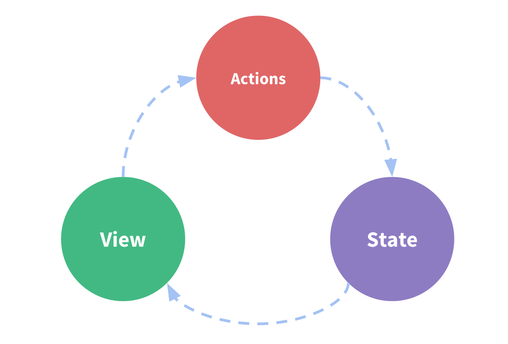

# 谈谈组件该如何存取数据

Vue官方提供了开箱即用的[Vuex](https://vuex.vuejs.org/zh/)，Vuex是什么？它是一个集中式的状态管理器。并且提供了很多方便开发者使用的工具函数，包括但不仅限于mapGetters、mapActions等。**但是我们真的需要使用Vuex吗？**

## Vuex解决了什么?

与其问Vuex解决了什么，不如先看看使用Vue组件开发时，遇到了什么问题？下面贴一下Vuex官方的部分文档。

来源：[https://vuex.vuejs.org/zh/](https://vuex.vuejs.org/zh/)

### 什么是“状态管理模式”？

让我们从一个简单的 Vue 计数应用开始：

```javascript
new Vue({
  // state
  data () {
    return {
      count: 0
    }
  },
  // view
  template: `
    <div>{{ count }}</div>
  `,
  // actions
  methods: {
    increment () {
      this.count++
    }
  }
})
```

这个状态自管理应用包含以下几个部分：

* **state**，驱动应用的数据源；
* **view**，以声明方式将 **state** 映射到视图；
* **actions**，响应在 **view** 上的用户输入导致的状态变化。



但是，当我们的应用遇到**多个组件共享状态**时，单向数据流的简洁性很容易被破坏：

* 多个视图依赖于同一状态。
* 来自不同视图的行为需要变更同一状态。

对于问题一，传参的方法对于多层嵌套的组件将会非常繁琐，并且对于兄弟组件间的状态传递无能为力。

对于问题二，我们经常会采用父子组件直接引用或者通过事件来变更和同步状态的多份拷贝。以上的这些模式非常脆弱，通常会导致无法维护的代码。

### 什么情况下我应该使用 Vuex？

Vuex 可以帮助我们管理共享状态，并附带了更多的概念和框架。这需要对短期和长期效益进行权衡。

如果您不打算开发大型单页应用，使用 Vuex 可能是繁琐冗余的。确实是如此——如果您的应用够简单，您最好不要使用 Vuex。一个简单的 [store 模式](https://cn.vuejs.org/v2/guide/state-management.html#%E7%AE%80%E5%8D%95%E7%8A%B6%E6%80%81%E7%AE%A1%E7%90%86%E8%B5%B7%E6%AD%A5%E4%BD%BF%E7%94%A8)就足够您所需了。但是，如果您需要构建一个中大型单页应用，您很可能会考虑如何更好地在组件外部管理状态，Vuex 将会成为自然而然的选择。

以上就是多组件多视图面临的状态管理问题，而Vuex把状态抽离统一管理很好的解决的问题。但是Vuex的官方文档也说明了什么情况下才应该使用Vuex。在使用Vuex的过程中又需要注意什么呢？

## Vuex是我们需要的，但不能滥用?

当开发过程中遇到某个组件需要异步获取数据并展示的话，是不是上来就是定义action、mutation以及state。然后在组件内的created或mounted事件钩子中触发action，再通过mapGetters引用进来。

很繁琐，特别是当这些状态仅当前组件会使用到。那上述的action-&gt;mutation-&gt;state，然后通过mapGetters把数据引进来的方式除了带来复杂性之外


