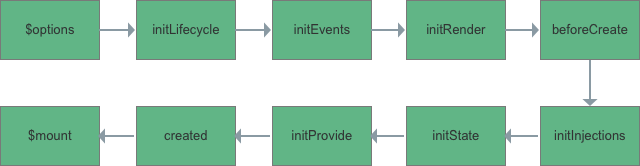

# 组件实例化过程

vue组件的实例化过程主要涉及到src/core/instance/init.js文件。主要包括以下加个过程：



### 1、$options合成

通过$options可以获取vue实例的初始化选项，需要在选项中包含自定义属性时会很有用。如element-ui的组件中都包含一个自定义的**componentName**属性，用于内部区分组件类型。

vue内部对$options的合成是区分内部组件和自定义组件的，并对内部组件做了相关合并优化，因为动态选项合并是比较慢的。

#### 内部组件$options优化合并



```javascript
function initInternalComponent (vm: Component, options: InternalComponentOptions) {
  const opts = vm.$options = Object.create(vm.constructor.options)
  // doing this because it's faster than dynamic enumeration.
  const parentVnode = options._parentVnode
  opts.parent = options.parent
  opts._parentVnode = parentVnode

  const vnodeComponentOptions = parentVnode.componentOptions
  opts.propsData = vnodeComponentOptions.propsData
  opts._parentListeners = vnodeComponentOptions.listeners
  opts._renderChildren = vnodeComponentOptions.children
  opts._componentTag = vnodeComponentOptions.tag

  if (options.render) {
    opts.render = options.render
    opts.staticRenderFns = options.staticRenderFns
  }
}
```



#### 自定义组件$options动态合并

先通过resolveConstructorOptions处理构造器选项，并会递归处理父组件选项。



```javascript
function resolveConstructorOptions (Ctor: Class<Component>) {
  let options = Ctor.options
  if (Ctor.super) {
    const superOptions = resolveConstructorOptions(Ctor.super)
    const cachedSuperOptions = Ctor.superOptions
    if (superOptions !== cachedSuperOptions) {
      // super option changed,
      // need to resolve new options.
      Ctor.superOptions = superOptions
      // check if there are any late-modified/attached options (#4976)
      const modifiedOptions = resolveModifiedOptions(Ctor)
      // update base extend options
      if (modifiedOptions) {
        extend(Ctor.extendOptions, modifiedOptions)
      }
      options = Ctor.options = mergeOptions(superOptions, Ctor.extendOptions)
      if (options.name) {
        options.components[options.name] = Ctor
      }
    }
  }
  return options
}
```



再通过mergeOptions函数进行选项动态合并。从代码中可以看到，对自定义选项中的extends和mixins字段会进行递归合并。其中又涉及到不同属性值的合并策略问题，比如data、props、methods、watch、声明周期钩子函数等等。详情参见[深入Vue属性合并策略](shen-ru-vue-shu-xing-he-bing-ce-lve/)。



```javascript
function mergeOptions (
  parent: Object,
  child: Object,
  vm?: Component
): Object {
  if (process.env.NODE_ENV !== 'production') {
    checkComponents(child)
  }

  if (typeof child === 'function') {
    child = child.options
  }

  normalizeProps(child, vm)
  normalizeInject(child, vm)
  normalizeDirectives(child)
  const extendsFrom = child.extends
  if (extendsFrom) {
    parent = mergeOptions(parent, extendsFrom, vm)
  }
  if (child.mixins) {
    for (let i = 0, l = child.mixins.length; i < l; i++) {
      parent = mergeOptions(parent, child.mixins[i], vm)
    }
  }
  const options = {}
  let key
  for (key in parent) {
    mergeField(key)
  }
  for (key in child) {
    if (!hasOwn(parent, key)) {
      mergeField(key)
    }
  }
  function mergeField (key) {
    const strat = strats[key] || defaultStrat
    options[key] = strat(parent[key], child[key], vm, key)
  }
  return options
}
```



总结：

### 2、初始化生命周期\(initLifecycle\)

此阶段主要初始化一些声明周期相关的属性和状态，它做了以下几件事情：

* 找出当前实例的第一个非抽象父组件，并将自身添加到父组件的$children列表中；
* 为$parent、$root赋值；
* 初始化$children、$refs属性值；
* 初始化实例内部属性值和相关状态；



```javascript
function initLifecycle (vm: Component) {
  const options = vm.$options

  // locate first non-abstract parent
  let parent = options.parent
  if (parent && !options.abstract) {
    while (parent.$options.abstract && parent.$parent) {
      parent = parent.$parent
    }
    parent.$children.push(vm)
  }

  vm.$parent = parent
  vm.$root = parent ? parent.$root : vm

  vm.$children = []
  vm.$refs = {}

  vm._watcher = null
  vm._inactive = null
  vm._directInactive = false
  vm._isMounted = false
  vm._isDestroyed = false
  vm._isBeingDestroyed = false
}
```



### 3、初始化相关事件\(initEvents\)

此过程主要初始化父组件的一些附加事件，事件来源是$options.\_parentListeners。



```javascript
function initEvents (vm: Component) {
  vm._events = Object.create(null)
  vm._hasHookEvent = false
  // init parent attached events
  const listeners = vm.$options._parentListeners
  if (listeners) {
    updateComponentListeners(vm, listeners)
  }
}

let target: any

function add (event, fn, once) {
  if (once) {
    target.$once(event, fn)
  } else {
    target.$on(event, fn)
  }
}

function remove (event, fn) {
  target.$off(event, fn)
}

function updateComponentListeners (vm: Component, listeners: Object, oldListeners: ?Object) {
  target = vm
  updateListeners(listeners, oldListeners || {}, add, remove, vm)
  target = undefined
}
```





```javascript
function updateListeners (
  on: Object,
  oldOn: Object,
  add: Function,
  remove: Function,
  vm: Component
) {
  let name, def, cur, old, event
  for (name in on) {
    def = cur = on[name]
    old = oldOn[name]
    event = normalizeEvent(name)
    /* istanbul ignore if */
    if (__WEEX__ && isPlainObject(def)) {
      cur = def.handler
      event.params = def.params
    }
    if (isUndef(cur)) {
      process.env.NODE_ENV !== 'production' && warn(
        `Invalid handler for event "${event.name}": got ` + String(cur),
        vm
      )
    } else if (isUndef(old)) {
      if (isUndef(cur.fns)) {
        cur = on[name] = createFnInvoker(cur)
      }
      add(event.name, cur, event.once, event.capture, event.passive, event.params)
    } else if (cur !== old) {
      old.fns = cur
      on[name] = old
    }
  }
  for (name in oldOn) {
    if (isUndef(on[name])) {
      event = normalizeEvent(name)
      remove(event.name, oldOn[name], event.capture)
    }
  }
}
```



### 4、初始化渲染函数\(initRender\)

* 初始化$slots和$scopedSlots；
* 绑定了内部使用的创建虚拟dom的\_c函数；
* 对外暴露创建虚拟dom的$createElement函数；
* 处理$attrs和$listeners，使他们对高阶组件是响应式的；

内部使用的\_c和对外暴露的$createElement函数内部都是使用createElement函数，仅最后一个参数不同而已。



```javascript
function initRender (vm: Component) {
  vm._vnode = null // the root of the child tree
  vm._staticTrees = null // v-once cached trees
  const options = vm.$options
  const parentVnode = vm.$vnode = options._parentVnode // the placeholder node in parent tree
  const renderContext = parentVnode && parentVnode.context
  vm.$slots = resolveSlots(options._renderChildren, renderContext)
  vm.$scopedSlots = emptyObject
  // bind the createElement fn to this instance
  // so that we get proper render context inside it.
  // args order: tag, data, children, normalizationType, alwaysNormalize
  // internal version is used by render functions compiled from templates
  vm._c = (a, b, c, d) => createElement(vm, a, b, c, d, false)
  // normalization is always applied for the public version, used in
  // user-written render functions.
  vm.$createElement = (a, b, c, d) => createElement(vm, a, b, c, d, true)

  // $attrs & $listeners are exposed for easier HOC creation.
  // they need to be reactive so that HOCs using them are always updated
  const parentData = parentVnode && parentVnode.data

  /* istanbul ignore else */
  if (process.env.NODE_ENV !== 'production') {
    defineReactive(vm, '$attrs', parentData && parentData.attrs || emptyObject, () => {
      !isUpdatingChildComponent && warn(`$attrs is readonly.`, vm)
    }, true)
    defineReactive(vm, '$listeners', options._parentListeners || emptyObject, () => {
      !isUpdatingChildComponent && warn(`$listeners is readonly.`, vm)
    }, true)
  } else {
    defineReactive(vm, '$attrs', parentData && parentData.attrs || emptyObject, null, true)
    defineReactive(vm, '$listeners', options._parentListeners || emptyObject, null, true)
  }
}
```



### 5、触发beforeCreate钩子函数

### 6、初始化注入对象\(initInjections\)

provide/inject是 Vue2.2.0新增的特性，主要为高阶插件和组件库提供帮助。初始化组件的inject选项过程其实只有简单的两步：

* 对inject选项进行遍历，然后通过父组件是否存在provide，并提供了对应选项；
* 处理inject对象，使其变成响应式数据；



```javascript
function initInjections (vm: Component) {
  const result = resolveInject(vm.$options.inject, vm)
  if (result) {
    toggleObserving(false)
    Object.keys(result).forEach(key => {
      /* istanbul ignore else */
      if (process.env.NODE_ENV !== 'production') {
        defineReactive(vm, key, result[key], () => {
          warn(
            `Avoid mutating an injected value directly since the changes will be ` +
            `overwritten whenever the provided component re-renders. ` +
            `injection being mutated: "${key}"`,
            vm
          )
        })
      } else {
        defineReactive(vm, key, result[key])
      }
    })
    toggleObserving(true)
  }
}
```



```javascript
function resolveInject (inject: any, vm: Component): ?Object {
  if (inject) {
    // inject is :any because flow is not smart enough to figure out cached
    const result = Object.create(null)
    const keys = hasSymbol
      ? Reflect.ownKeys(inject).filter(key => {
        /* istanbul ignore next */
        return Object.getOwnPropertyDescriptor(inject, key).enumerable
      })
      : Object.keys(inject)

    for (let i = 0; i < keys.length; i++) {
      const key = keys[i]
      const provideKey = inject[key].from
      let source = vm
      while (source) {
        if (source._provided && hasOwn(source._provided, provideKey)) {
          result[key] = source._provided[provideKey]
          break
        }
        source = source.$parent
      }
      if (!source) {
        if ('default' in inject[key]) {
          const provideDefault = inject[key].default
          result[key] = typeof provideDefault === 'function'
            ? provideDefault.call(vm)
            : provideDefault
        } else if (process.env.NODE_ENV !== 'production') {
          warn(`Injection "${key}" not found`, vm)
        }
      }
    }
    return result
  }
}
```

### 7、初始化状态\(initState\)

初始化顺序props-&gt;methods-&gt;data-&gt;computed-&gt;watch。



```javascript
function initState (vm: Component) {
  vm._watchers = []
  const opts = vm.$options
  if (opts.props) initProps(vm, opts.props)
  if (opts.methods) initMethods(vm, opts.methods)
  if (opts.data) {
    initData(vm)
  } else {
    observe(vm._data = {}, true /* asRootData */)
  }
  if (opts.computed) initComputed(vm, opts.computed)
  if (opts.watch && opts.watch !== nativeWatch) {
    initWatch(vm, opts.watch)
  }
}
```



### 8、初始化\(initProvide\)



```javascript
function initProvide (vm: Component) {
  const provide = vm.$options.provide
  if (provide) {
    vm._provided = typeof provide === 'function'
      ? provide.call(vm)
      : provide
  }
}
```



### 9、触发created钩子函数


